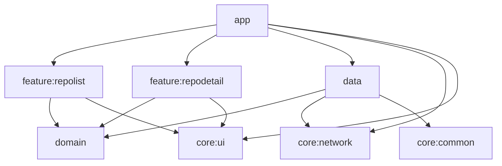
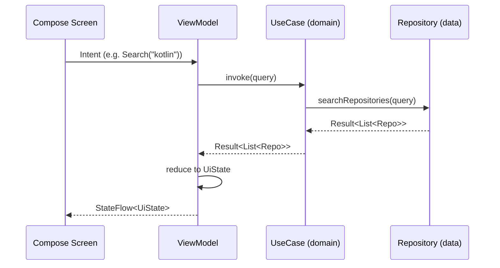

# Clean Architecture Android

A production-oriented Android template: Clean Architecture, MVI, Jetpack Compose, Hilt, and Coroutines, demonstrated with a GitHub repository browser.

## Module graph

## Data flow (MVI)

## Why this structure

- `:domain` and `:data` are pure-Kotlin JVM modules — no Android dependency, so business logic is testable without an emulator and compiles faster.
- Hilt wiring (`@Module`/`@InstallIn`) lives only in `:app`; `:domain`/`:data` classes use plain `@Inject constructor` (JSR-330), keeping them framework-agnostic.
- Each feature module owns its own MVI contract (Intent/UiState/ViewModel/Screen) — no shared "god" ViewModel.
- No local persistence (Room) by design — the goal is to demonstrate the domain/data boundary, not build an offline-capable app. Swapping in a local source of truth means adding a `LocalRepoDataSource` in `:data` and combining it in `GitHubRepoRepositoryImpl` — no change needed in `:domain` or the feature modules.

## Setup

1. Clone the repo and open it in Android Studio (Ladybug or newer).
2. Ensure Android SDK platform 35 and build-tools 35.0.0 are installed.
3. Run `./gradlew :app:installDebug` with a device/emulator connected, or use the `app` run configuration in Android Studio.

## Testing

- All unit tests: `./gradlew test`
- Per module: `./gradlew :domain:test`, `./gradlew :data:test`, `./gradlew :feature:repolist:testDebugUnitTest`, `./gradlew :feature:repodetail:testDebugUnitTest`
- Compose UI tests (require a connected device/emulator): `./gradlew :feature:repolist:connectedDebugAndroidTest :feature:repodetail:connectedDebugAndroidTest`
- Lint: `./gradlew ktlintCheck detekt`

## License

MIT — see [LICENSE](LICENSE).
