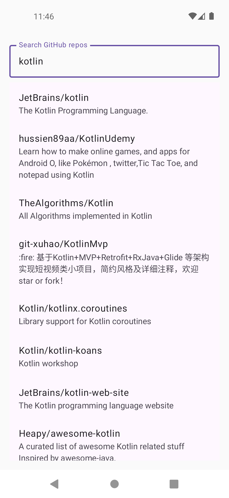
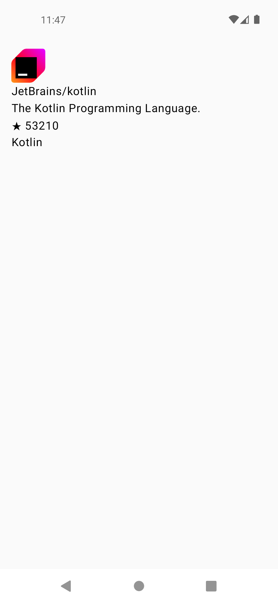
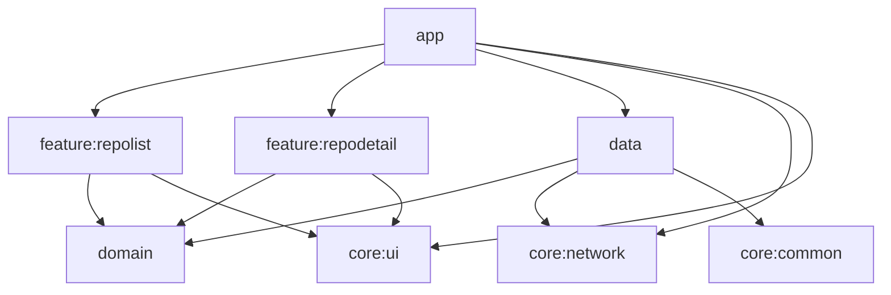
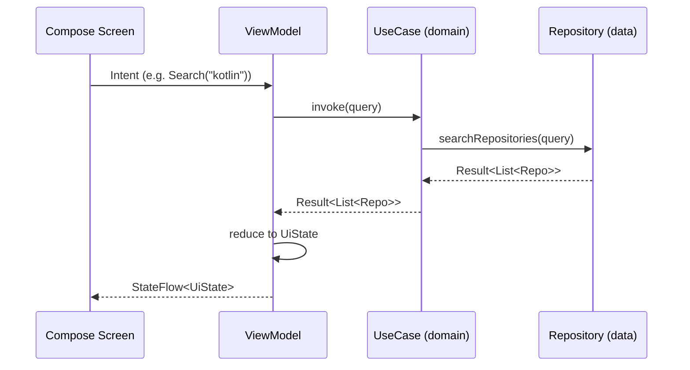

# Clean Architecture Android

Another "Clean Architecture" repo, yes. There are a thousand of these. The difference is this one actually builds, actually has tests that check something, and the module boundaries aren't just a suggestion — `:domain` and `:data` are pure Kotlin, so there's no sneaking an `Activity` in there when nobody's looking.

It's a GitHub repo browser: search a query, get real results from GitHub's API, tap one, see the details. Not exactly groundbreaking as an app, which is the point — the app is boring on purpose so the architecture gets to be the interesting part.

## Screenshots

<table>
<tr>
<td></td>
<td></td>
</tr>
<tr>
<td align="center">Search — real results, not a fake list</td>
<td align="center">Detail — avatar, stars, language</td>
</tr>
</table>

## Module graph

## Data flow (MVI)

## Why it's built this way

- **`:domain` and `:data` are plain Kotlin JVM modules** — no Android import is even possible in there, so "the business logic doesn't know it's running on a phone" isn't a promise, it's a compiler error waiting to happen if someone tries.
- **Hilt lives in `:app`, and only `:app`.** `:domain`/`:data` classes just take a constructor argument like it's 2015 (`@Inject`, no framework opinions). Nobody has to go hunting through five modules to find where the DI graph is actually assembled.
- **Every feature owns its own MVI contract** — Intent, UiState, ViewModel, Screen, all living together in one module. No shared mega-ViewModel that everyone's afraid to touch.
- **No Room, on purpose.** This isn't an offline-first app, it's an architecture demo — adding a local cache means writing a `LocalRepoDataSource` and combining it inside `GitHubRepoRepositoryImpl`. `:domain` and the feature modules wouldn't need to know it happened.

## Real-world perspective

I built this template from lessons learned building production fintech and payment mobile apps. In production environments handling real money, architectural decisions have immediate costs:

- A loose module boundary = a week of debugging data integrity issues
- Poor separation of concerns = compounds when handling sensitive transactions
- Weak DI setup = credentials or keys accidentally leaked to the wrong layer
- Weak testing = silent failures that affect millions

This template exists because "it worked in my demo" and "it worked in production" are very different things. Every decision here is opinionated on purpose — the boundaries are enforced, not suggested.

**Real-world patterns from building at scale:**
- Clean Architecture isn't theoretical — it's how you survive scaling
- MVI forces explicitness around state, which matters when state = money
- Proper module separation prevents footguns before they happen

**Learn more in my detailed guides:**
- [Clean Architecture in Android: A Real-World Guide](https://medium.com/@nerojust4/clean-architecture-in-android-a-real-world-guide-2025-edition-e5b4e950674c)
- [Mastering Dependency Injection with Hilt](https://medium.com/@nerojust4/mastering-dependency-injection-with-hilt-in-android-81b3d221da9a)

## Setup

1. Clone it, open it in Android Studio (Ladybug or newer).
2. Make sure you've got Android SDK platform 35 and build-tools 35.0.0 installed.
3. `./gradlew :app:installDebug` with a device or emulator plugged in, or just hit run in Android Studio like a normal person.

## Testing

- Everything: `./gradlew test`
- One module at a time: `./gradlew :domain:test`, `./gradlew :data:test`, `./gradlew :feature:repolist:testDebugUnitTest`, `./gradlew :feature:repodetail:testDebugUnitTest`
- Compose UI tests (need a device/emulator plugged in): `./gradlew :feature:repolist:connectedDebugAndroidTest :feature:repodetail:connectedDebugAndroidTest`
- Lint, because CI will yell at you otherwise: `./gradlew ktlintCheck detekt`

## License

MIT — see [LICENSE](LICENSE). Fork it, rip out the GitHub API bit, put your own domain in `:domain`, and go build the thing you actually wanted to build.

## Connect

- [LinkedIn](https://www.linkedin.com/in/nerojust/)
- [Medium](https://medium.com/@nerojust4)
- [Dev.to](https://dev.to/nerojust/building-payment-flows-in-android-lessons-from-real-fintech-apps-5a09) — building payment flows in Android, lessons from real fintech apps
- [GitHub](https://github.com/Nerojust) — follows appreciated
